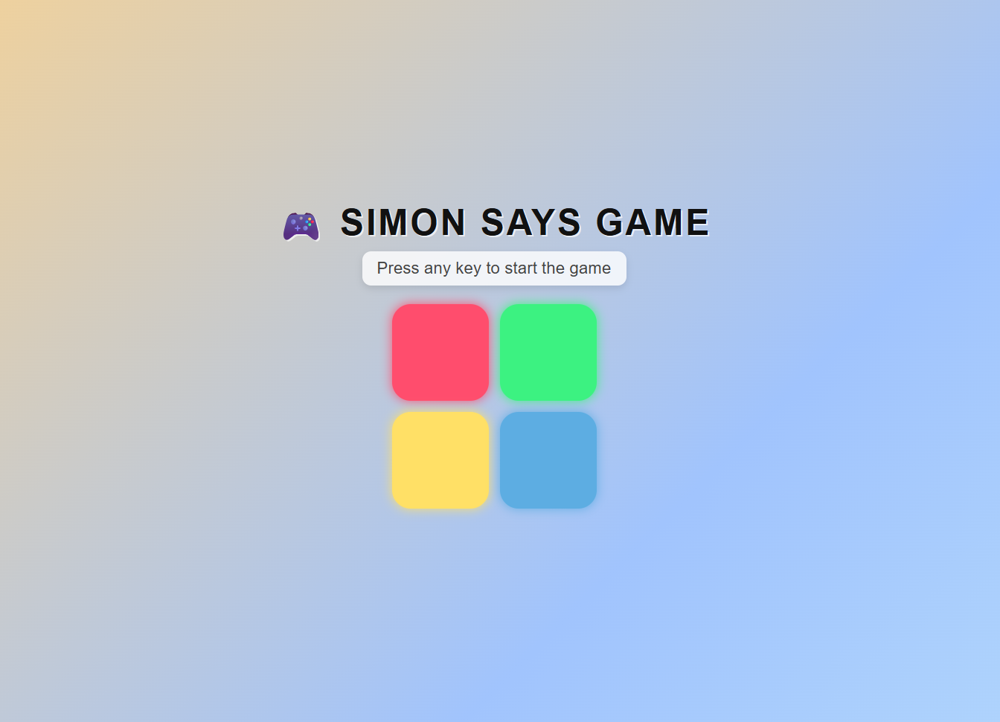

# 🎮 Simon Says Game

A fun and interactive **Simon Says memory game** built using **HTML, CSS, and JavaScript**.  
The game challenges players to remember and repeat an increasingly long sequence of button presses.

---

## 🚀 Features
- Colorful neon-styled buttons (Red, Green, Yellow, Blue)
- Dynamic **background gradient animation**
- Level progression with increasing difficulty
- Flash animations for both game sequence and user input
- Responsive design (works on mobile and desktop)
- Game Over screen with score display and restart option

---

## 🛠️ Technologies Used
- **HTML5** – Structure of the game  
- **CSS3** – Styling with gradient backgrounds, neon effects, and animations  
- **JavaScript (ES6)** – Game logic, sequence generation, and event handling  

---

## 📂 Project Structure
├── index.html # Main HTML file   
├── simon say game.css # Stylesheet   
├── simon say game.js # Game logic


---

## 🎯 How to Play
1. Press **any key** to start the game.  
2. Watch the sequence of button flashes carefully.  
3. Repeat the sequence by clicking the correct buttons in order.  
4. Each round adds a new step to the sequence.  
5. If you make a mistake, the game ends and your score is displayed.  

---

## 🖥️ Installation & Setup
1. Clone this repository or download the files.
   ```bash
   git clone https://github.com/yourusername/simon-says-game.git
   Open index.html in your browser.

Start playing! 🎉

## 📸 Screenshots


## 📜 License

This project is open-source and available under the MIT License.

## ✨ Made with ❤️ using HTML, CSS & JavaScript
